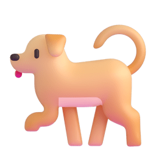

# 👋 Hi, I’m Torijune  Welcome to my profile!

## About me :
#### 🧠 Interest : Machine Learning & Deep Learning, Nature Language Processing (NLP), MLOps
#### 🏫 College : **Myongji University (2021 March ~ Present)** 🏫

#### 📐 Main Major : **Mathematics (2021 March ~ Present)** 🔢
#### 📈 Double Major : **Industrial and Management Engineering (2022 September ~ Present)** 📊
#### Colleage Club1 : 💻 **'FOM'(Focus on Data Mining) - Data Mining Club (2023 March ~ Present)** 🖥️   

#### Colleage Club2 : 🗨️ **'Time' - English conversation and Reading English Journal Club (2022 March ~ 2024 March)** 🗣️

### For more details about my experience and projects  
- Google Scholar: [🎓 Scholar Profile](https://scholar.google.com/citations?user=2NowlBIAAAAJ&hl=ko)
- Check out my CV!! : [📄 Curriculum Vitae](https://www.overleaf.com/read/mykvzjvcdkgw#9c2062)  

---

## Skills

## Github Stats

  <h2>Contact Me</h2>
  
  

